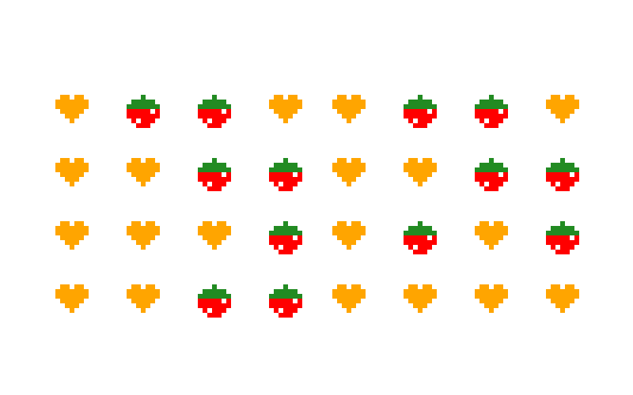
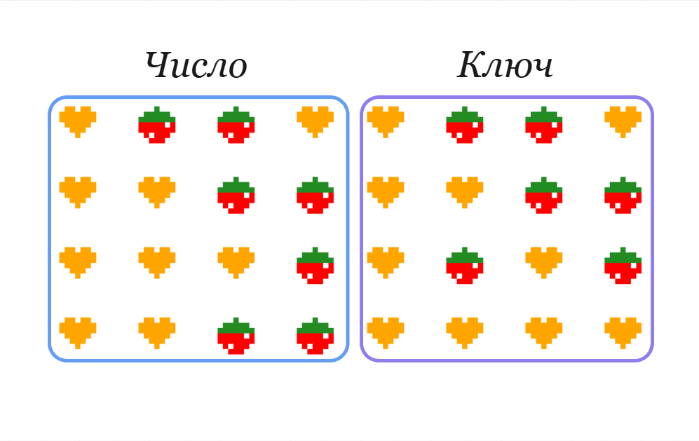

# Шифр числа

Программа для шифрования чисел в изображение. Алгоритм преобразует число в последовательность картинок при помощи операции XOR с случайно сгеннерированным ключом.



## Инструкция по запуску
Чтобы зашифровать своё собственное число, вам нужно отредактировать главный скрипт программы.
1. Откройте файл `script.py`
2. Спуститесь в самый низ файла (блок `# Запуск`).
3. В функции `generate_visual_cipher(number, bit_length)` замените первый аргумент на **ваше число**, которое хотите зашифровать.

Например, если вы хотите зашифровать число `777`:
```python
generate_visual_cipher(777, 16)
```
Также перед запуском программы убедитесь, что у вас установлена библиотека **Pillow** для генерации изображений.
```bash
pip install Pillow
```

## Инструкция по расшифровке
Чтобы узнать спрятанное число, нужно перевести картинку в бинарный код (нули и единицы) и выполнить операцию XOR.

### Шаг 1
Каждая фигура - это **один бит информации**.
- *Сердце* = `1`
- *Клубника* = `0`

### Шаг 2
Картинка разделена на две части: **левая половина** (4x4) - это зашифрованные данные, **правая половина** (4x4)- это ключ. Считываем их по строчкам.

Разберем на примере числа: `67`



**Левая часть (зашифрованные данные):**
- 🧡🍓🍓🧡 → `1001`
- 🧡🧡🍓🍓 → `1100`
- 🧡🧡🧡🍓 → `1110` 
- 🧡🧡🍓🍓 → `1100`

    Итоговое бинарное число: `1001 1100 1110 1100`

**Правая часть (Ключ):**
- 🧡🍓🍓🧡 → `1001` 
- 🧡🧡🍓🍓 → `1100` 
- 🧡🍓🧡🍓 → `1010` 
- 🧡🧡🧡🧡 → `1111`

    Итоговый ключ: `1001 1100 1010 1111`

### Шаг 3
Теперь нужно сравнить биты данных и ключа. Правило XOR простое: если фигурки одинаковые, пишем 0, если разные - пишем 1.

| Позиция | Данные | Ключ | Результат (XOR) |
| :--- | :---: | :---: | :---: |
| **1-4** | `1001` | `1001` | `0000` |
| **5-8** | `1100` | `1100` | `0000` |
| **9-12** | `1110` | `1010` | `0100` |
| **13-16** | `1100` | `1111` | `0011` |

Полученное бинарное число: `0000 0000 0100 0011`

### Шаг 4
Отбрасываем лишние нули впереди и получаем 1000011. Переводим из двоичной системы в десятичную:

$$1 \cdot 2^6 + 0 \cdot 2^5 + 0 \cdot 2^4 + 0 \cdot 2^3 + 0 \cdot 2^2 + 1 \cdot 2^1 + 1 \cdot 2^0$$

$$64 + 0 + 0 + 0 + 0 + 2 + 1 = \mathbf{67}$$

Ответ: `67`

### Примечание

Из-за того что В 16-битной системе можно закодировать $2^{16}$ различных комбинаций - то максимальное число для кодировки - `65 535`

